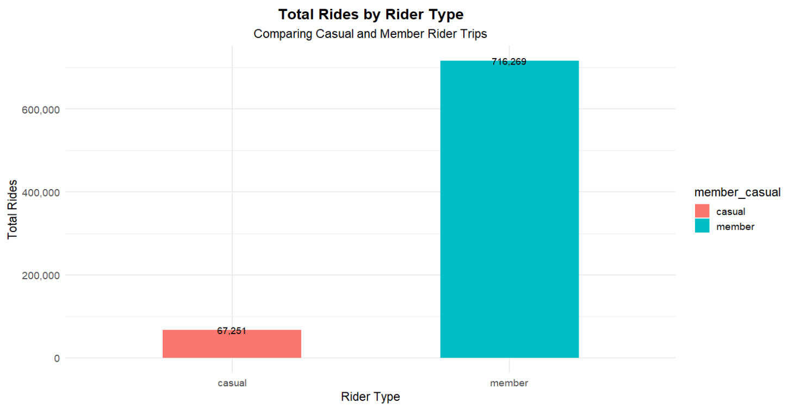
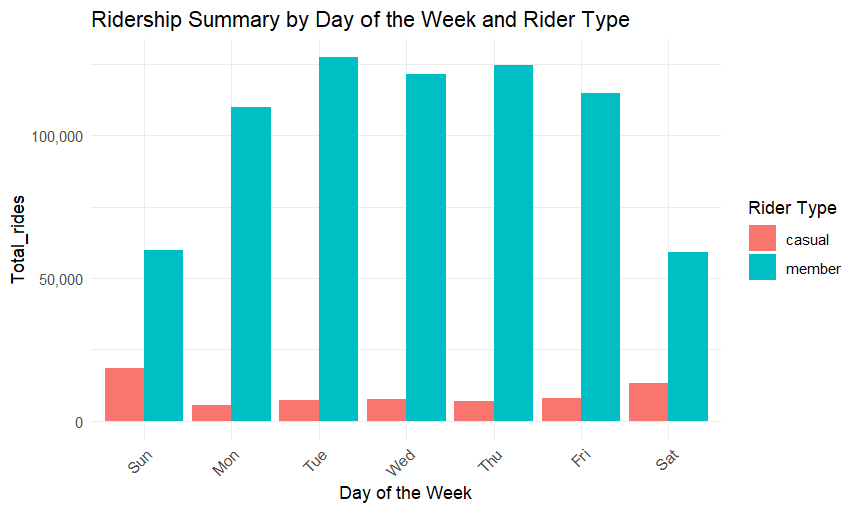
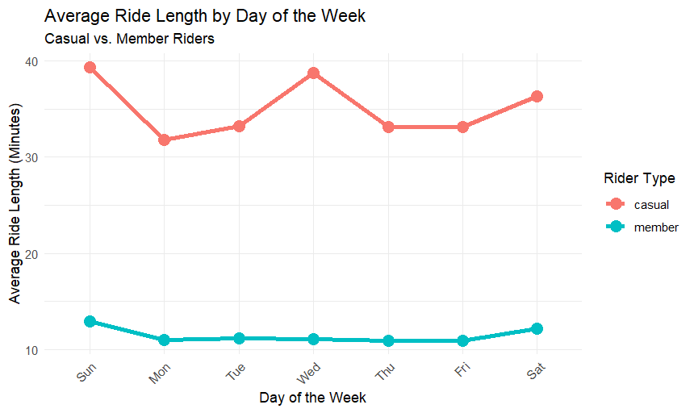
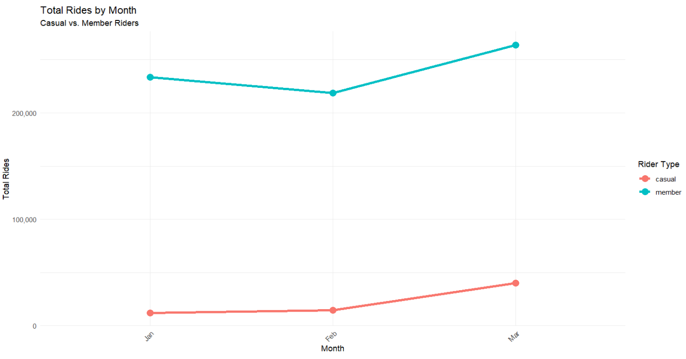
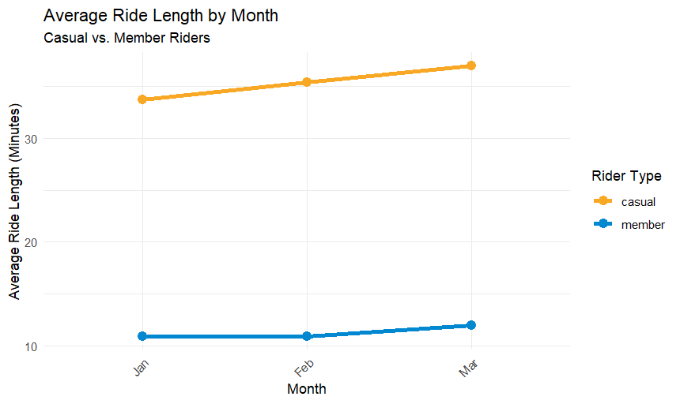

# r-cyclistic-bike-share-analysis
# Divvy Cyclistic Bike-Share Case Study: Converting Casual Riders to Members

## Project Summary

This project analyzes the 2019-2020 Q1 historical trip data for Cyclistic, a Chicago bike-share company. The goal was to identify distinct patterns between **casual riders** and **annual members** to develop a targeted marketing strategy aimed at converting casual riders into annual members.

### Business Objective

Analyze how casual riders and annual members use the bike-share service differently to inform a marketing strategy for increasing annual membership enrollment.

### Tools and Technologies

| Tool/Language | Function |
| :--- | :--- |
| **R (tidyverse, lubridate)** | Data cleaning, manipulation, analysis and visualization. |
| **R Markdown** | Reporting and generating the final analysis document. |
| **Kaggle** | Source of Dataset. |

## Data Cleaning and Preparation

Steps undertaken include:

1. Renamed, dropped, and standardized column types in the 2019 datast to allow for merging with the 2020 dataset.
2. Changed the `usertype` column in the 2019 data ("Subscriber," "Customer") to match the 2020 format ("member," "casual").
3. Calculated **`ride_length_mins`** and extracted **`day_of_week`**, **`month`**, and **`year`** from the timestamp column for comparative analysis.
4. Removed invalid or extreme outliers: rides less than 1 minute (system tests) and rides longer than 16 hours (960 minutes, likely data errors or missing end times).
5. Created a standardized and cleaned table of all unique station coordinates to support potential geographic visualization.

## Key Findings and Insights

The analysis confirmed significant differences in trip volume, duration and usage context between the two customer segments.

### 1. Trip Volume and Duration

| Rider Type | Total Rides (Q1) | Average Ride Length |
| :--- | :--- | :--- |
| **Member** | 716,269 | **~11 minutes** |
| **Casual** | 67,251 | **~36 minutes** |

* Members are the most frequent users (over 10x the rides), confirming their profitability. Casual riders, conversely, take trips that are over **three times longer** on average, suggesting a leisure-focused use.

### Image 1: Total Rides by Rider Type

2. Annual Members are consistent high volume users focused on short reliable weekday commuting. While Casual Riders primarily use the service for extended weekend leisure, with their total ridership tripling from January to March, demonstrating a reliance on warm weather for recreational use.

### Image 2: Ridership Summary by Day of the Week and Rider Type

### Image 3: Average Ride Length by Day of the Week

### Image 4: Total Rides by month

### Image 5: Average Ride Length by Month

3. The stations used show different rider goals. **Casual Riders** start trips mostly near **tourist spots** (i.e Shedd Aquarium, Millenium Park), confirming they ride for leisure. **Annual Members** mainly use stations in the **city center** and near train stations, showing they ride for work. Only a few places like Michigan Ave & Washington St, are popular with both groups, suggesting it serves as a central hub for both commuters and tourists.

## Marketing Recommendations

1. Casual riders tend to use the service for leisure and are most active during the weekend and warmer months. This provides the best opportunity to convert them to members by placing digital ads at high-traffic stations near parks and other popular spots. The ads should clearly demonstrate how a membership is a better value than buying multiple day passes.

2. Introduce a low cost, short term pass that acts as a stepping stone i.e. monthly or quartely passes offering unlimited rides, with a built in incentive to upgrade. By offering a discount on annual membership after a certain number of uses, this strategy lowers the entry barrier and smoothly converts casual riders into annual members.

3. To convert casual riders to annual members, shift their perception of Cyclistic from a leisure tool to a daily utility. Launch a campaign that highlights how members use the bikes for cost-effective commutes and errands. 

***

## 📁 Repository Structure

* `README.md` (Project summary and findings)
* `Cyclistic_Case_Study.Rmd` (Full R Markdown script containing all code, cleaning, and analysis)
* Visualisation Images `Image1.png`,  `Image2.png`, `Image3.png`, `Image4.png` and `Image5.png`

End-to-end data analysis in R to clean, transform, and analyze Cyclistic's rider data. Identifies key differences between casual and annual members to drive marketing strategy .
